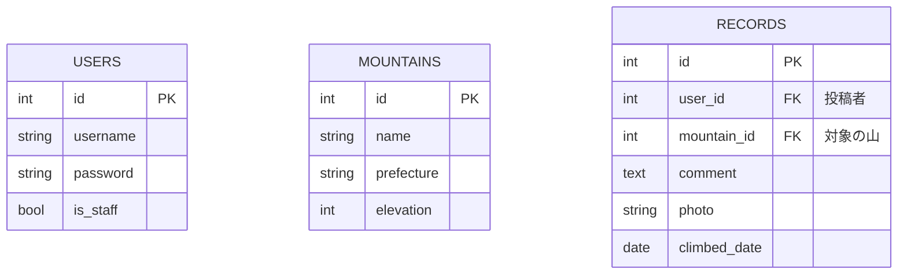

# mountain_recoder
アプリケーション開発演習 自由課題①

## サイトマップ

    1. / (トップページ・山の一覧)
    |
    |-- [機能] 山の名前での検索 (GET: /?q=...)
    |-- [リンク] -> 1.1 山の詳細ページ
    |-- [リンク] -> 2.1 ログインページ (未ログイン時)
    |-- [リンク] -> 4.1 新しい山の登録ページ (管理者のみ)
    |
    1.1 /mountain/<id>/ (山の詳細ページ)
        |
        |-- [表示] 山の情報 (都道府県, 標高)
        |-- [表示] その山の全登山記録リスト
        |   |-- [表示] 各記録の写真、コメント、投稿者、日時
        |   |-- [リンク] -> 3.2 記録の編集ページ (自分の投稿のみ)
        |   `-- [リンク] -> 3.3 記録の削除ページ (自分の投稿のみ)
        |
        |-- [フォーム] 新しい登山記録の投稿 (要ログイン)
        |   `-- [POST] -> (自身にリダイレクト)
        |
        |-- [リンク] -> 4.2 山の編集ページ (管理者のみ)
        `-- [リンク] -> 1. トップページ (一覧に戻る)

    2. /accounts/ (ユーザー認証)
    |
    2.1 /accounts/login/ (ログインページ)
        |
        `-- [POST] -> (ログイン後、元のページまたはトップページにリダイレクト)
    |
    2.2 /accounts/logout/ (ログアウト処理・完了ページ)

    3. ログインユーザー向けページ
    |
    3.1 /mypage/ (マイページ)
    |   |
    |   |-- [表示] 自分が投稿した全記録の一覧
    |   |-- [リンク] -> 1.1 山の詳細ページ
    |   |-- [リンク] -> 3.2 記録の編集ページ
    |   `-- [リンク] -> 3.3 記録の削除ページ
    |
    3.2 /record/<id>/edit/ (登山記録の編集ページ)
    |   |
    |   |-- [フォーム] 既存の記録の編集 (日付, コメント, 写真)
    |   `-- [POST] -> 1.1 山の詳細ページ
    |
    3.3 /record/<id>/delete/ (登山記録の削除確認ページ)
        |
        |-- [表示] 削除する記録の確認
        `-- [POST] -> 1.1 山の詳細ページ

    4. 管理者 (スタッフ) 向けページ
    |
    4.1 /mountain/add/ (新しい山の登録ページ)
    |   |
    |   |-- [フォーム] 新しい山の情報入力
    |   `-- [POST] -> 1. トップページ
    |
    4.2 /mountain/<id>/edit/ (山の編集ページ)
    |   |
    |   |-- [フォーム] 既存の山の情報編集
    |   |-- [リンク] -> 4.3 山の削除確認ページ
    |   `-- [POST] -> 1.1 山の詳細ページ
    |
    4.3 /mountain/<id>/delete/ (山の削除確認ページ)
        |
        |-- [表示] 削除する山の確認と警告
        `-- [POST] -> 1. トップページ

    5. その他
    |
    5.1 /admin/ (Django管理サイト)

## データベース設計

